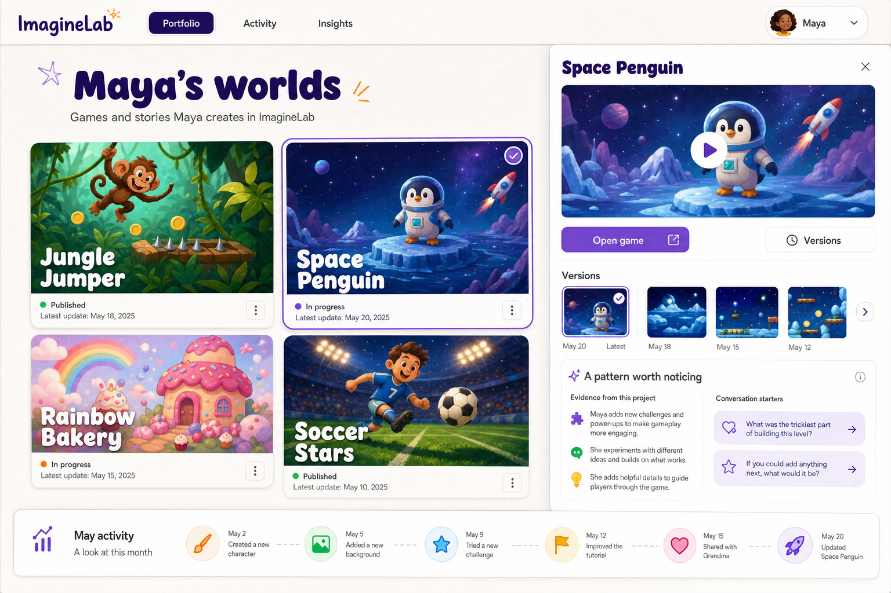
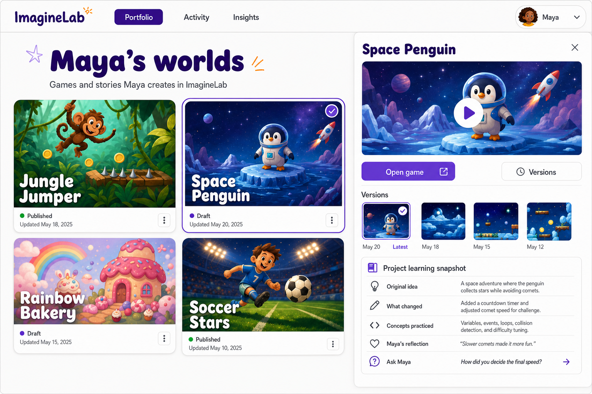
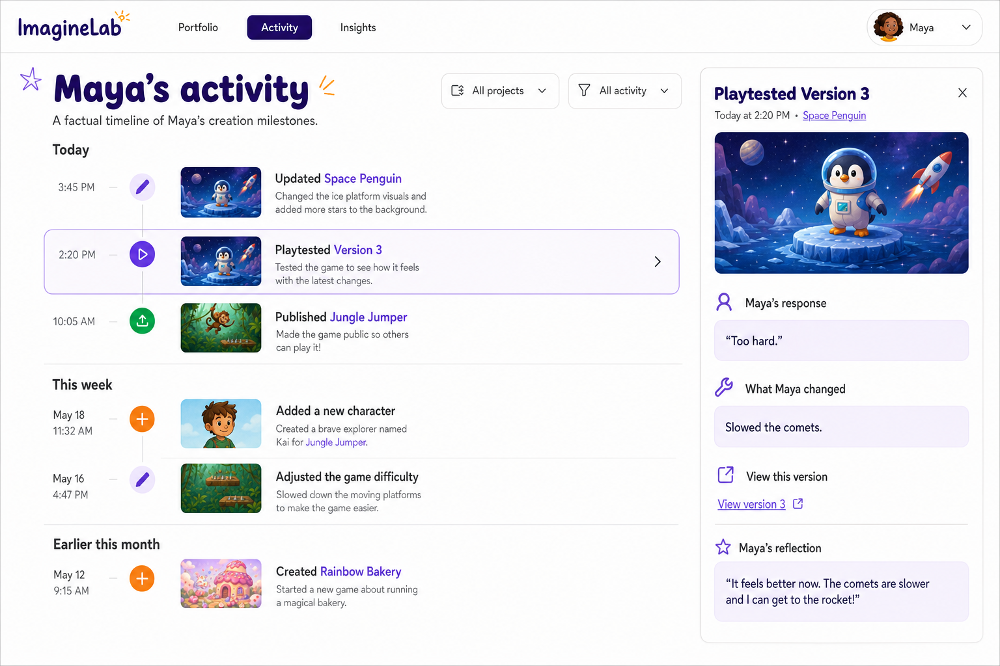
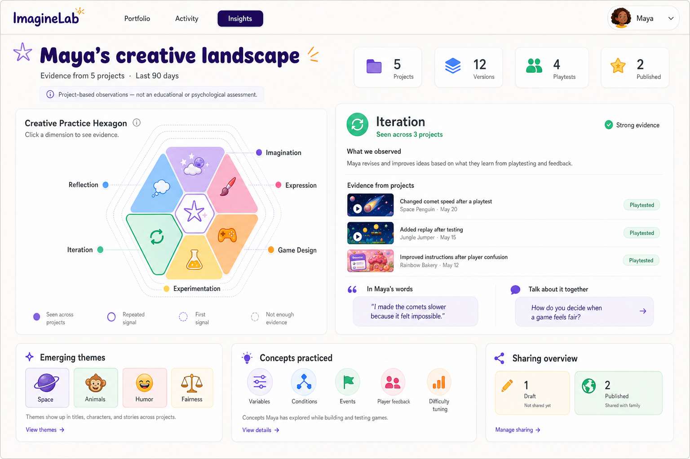

# ImagineLab Parent Portal

The ImagineLab Parent Portal is a responsive React and Vite website for guardians. It gives a
linked parent a clear view of what their child has created, how individual projects changed over
time, which creative practices were observed, and how to start a supportive conversation about
the work.

The guiding principle is:

> AI summarizes the child's creative process. It does not evaluate the child.

Insights must be grounded in project evidence. The portal must not score, rank, diagnose, compare,
predict a career, or claim fixed traits, intelligence, ability, or potential.

## Design reference

The three portal surfaces share the visual language of this reference: a quiet white app canvas,
deep-purple navigation, rounded controls and panels, bold friendly typography, vivid game artwork,
and a selected-project detail drawer.



The reference is a direction, not the final information architecture. In particular:

- The monthly activity strip should not appear on the Portfolio page.
- The vague "A pattern worth noticing" panel should be replaced with evidence-based information.
- Portfolio, Activity, and Insights should be three independent, coordinated pages.

## Information architecture

The global header contains the ImagineLab brand, three primary navigation tabs, and a linked-child
selector:

1. **Portfolio** — projects, playable previews, immutable versions, and publishing status.
2. **Activity** — chronological create, edit, playtest, publish, and unpublish events.
3. **Insights** — a guardian-focused dashboard of evidence-based creative signals across projects.

All three pages use the same child context, date language, typography, colors, project artwork,
status treatment, and reusable controls.

## Coordinated page concepts

These three concept screens extend the reference into one shared parent-portal design system. They
are the visual specifications used by the current React implementation.

### Portfolio concept



### Activity concept



### Insights concept



## Page 1: Portfolio

Portfolio is a visual exhibition of the child's games. It answers: **What has my child made?**

### Primary content

- Page title such as `Maya's worlds` and a short description.
- A responsive gallery of project cards with thumbnail, title, updated date, and draft/published
  status.
- A selected-project state that opens a right-side detail drawer.
- A large playable preview and an `Open game` action.
- An immutable version gallery with dates and a clearly selected version.
- Publishing status and access to the currently published artifact.

### Project learning snapshot

The selected-project drawer replaces "A pattern worth noticing" with a concrete **Project learning
snapshot**:

- Original idea.
- What changed between versions.
- Concepts practiced in the project.
- Playtest result, when available.
- A child-authored reflection, when available.
- One project-specific conversation starter.

Every statement must point to a project decision, version, playtest, or reflection. The drawer must
not infer a general personality or ability from one project.

## Page 2: Activity

Activity is the factual creation history. It answers: **What did my child do, and when?**

### Primary content

- A chronological timeline grouped by day or week.
- Filters for project and event type.
- Create, edit, playtest, reflection, publish, and unpublish events.
- Project thumbnail, project title, event time, and a concise event description.
- Expandable version details when the guardian has permission to see them.
- A clear empty state for periods with no activity.

Activity is not a progress score, streak system, or screen-time surveillance view. It reports
meaningful creation milestones without rewarding volume or comparing the child with anyone else.

The exact prompt and version evidence shown to a guardian remains a product-policy decision. Until
that policy is confirmed, the UI should use high-level milestones and child-approved reflections
rather than raw voice transcripts.

## Page 3: Insights

Insights is an evidence dashboard across several projects. It answers:

- How has my child approached making games?
- Which concepts have appeared in their work?
- What themes are they currently exploring?
- What did they say about their own decisions?
- What can we talk about together?

### Creative Practice Hexagon

The primary visualization is a clickable **Creative Practice Hexagon** with six project-grounded
dimensions:

1. **Imagination** — combining characters, worlds, goals, and mechanics.
2. **Expression** — communicating ideas through story, character, visual, and tonal choices.
3. **Game Design** — connecting player goals, rules, challenge, feedback, and win conditions.
4. **Experimentation** — making predictions, trying alternatives, and testing ideas.
5. **Iteration** — changing a project in response to playtesting or a discovered problem.
6. **Reflection** — explaining decisions, challenges, proud moments, and possible next steps.

The hexagon represents **evidence observed in the selected projects and period**, not a measurement
of the child's ability. It must not display percentages, grades, peer benchmarks, or an overall
score.

Use evidence states such as:

- `First signal` — observed in one project.
- `Repeated signal` — observed more than once.
- `Seen across projects` — supported by several projects.
- `Not enough evidence` — no supported conclusion yet.

Selecting a dimension opens an evidence panel containing:

- What was observed, using bounded language.
- Supporting projects and versions.
- A relevant child reflection.
- A parent conversation starter.

### Supporting insight modules

- **Creative snapshot:** factual counts for projects, versions, playtests, and published games.
- **Emerging themes:** recurring subjects such as space, animals, sports, humor, or fairness, each
  tied to project evidence.
- **Concepts practiced:** variables, conditions, events, collision, player feedback, difficulty
  tuning, and other concepts demonstrated by child-originated decisions.
- **In their own words:** child-authored reflections, never an AI-generated quote.
- **Conversation starters:** questions connected to recent project decisions.
- **Sharing overview:** current draft and published states with links to public games.
- A visible disclaimer: `Project-based observations — not an educational or psychological assessment.`

## Evidence model

Insights should use child-originated decisions and reflections:

- Initial idea and approved Game Recipe choices.
- Free-form edit requests.
- Predictions made before a change.
- Child-reported playtest results.
- Differences between immutable versions.
- Child-authored reflections.
- Publish and continued-improvement events.

The visual quality or technical complexity of AI-generated HTML must not be treated as evidence of
the child's ability. The backend should return structured evidence for every observation and return
`Not enough evidence` instead of inventing a conclusion.

## Backend boundary

The React frontend renders data and interactions. Sensitive work stays in the backend:

```text
Parent Portal
    -> authenticated backend request
Fastify backend
    -> verifies guardian-child access
    -> reads projects, versions, playtests, reflections, and activity
    -> calls OpenAI for a structured evidence summary when requested
    -> returns authorized JSON
Parent Portal
    -> renders Portfolio, Activity, and Insights
```

The OpenAI API key, PostgreSQL credentials, password hashes, and session-token hashes must never be
included in the parent website.

## Local development

```bash
npm install
cp .env.example .env
npm run dev
```

The backend must be running at `VITE_API_BASE_URL` (default: `http://localhost:8080`).

## Checks

```bash
npm run check
```
